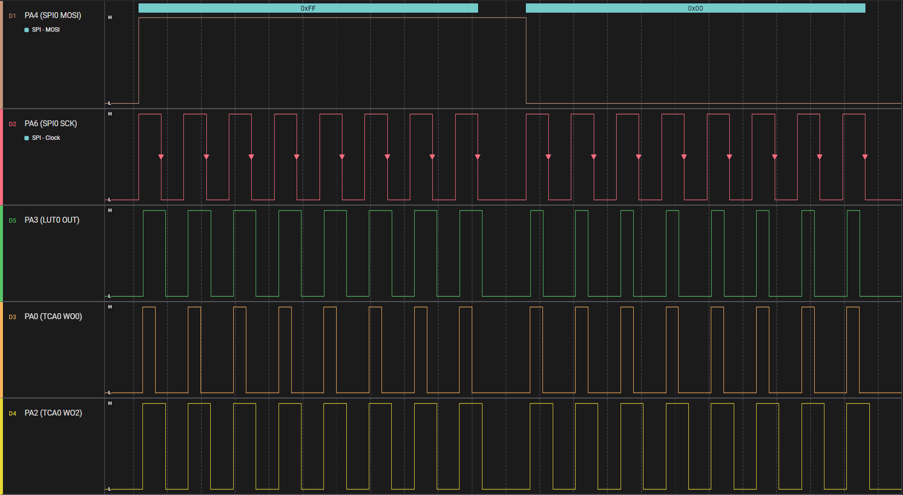
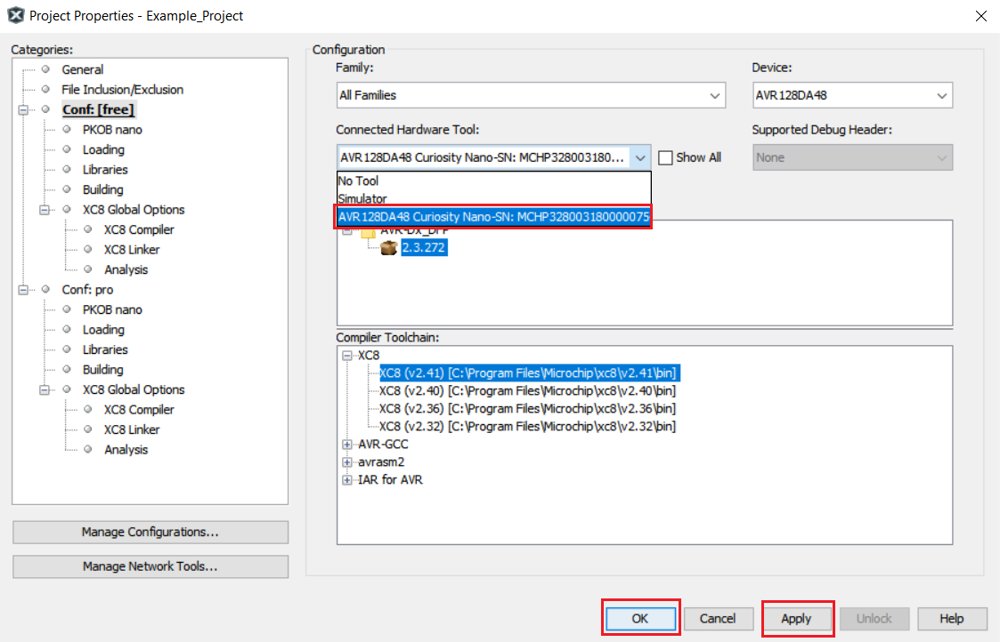

<!-- Please do not change this html logo with link -->

# RGB lighting with WS2812 using AVR128DA48 Microcontroller with MCC Melody

This repository provides an MPLAB® X project with an MPLAB® Code Configurator (MCC) generated code example for interfacing the CCL (Configurable Custom Logic) and SPI (Serial Peripheral Interface) peripherals with the WS2812 LED. The messages compatible with the WS2812 LED are formed from ones and zeros with a specific duration and form. The application translates the messages sent by SPI into messages intelligible by WS2812, using CCL. Furthermore, it creates a light game on a WS2812 LED band.

## Related Documentation

More details and code examples on the AVR128DA48 can be found at the following links:

- [AVR128DA48 Product Page](https://www.microchip.com/wwwproducts/en/AVR128DA48)
- [AVR128DA48 Code Examples on GitHub](https://github.com/microchip-pic-avr-examples?q=avr128da48)
- [WS2812 Datasheet](https://www.tme.com/Document/1d930d9b83e8cce43e5d1c490ab0fbe8/WS2818A.pdf)

## Software Used

- [MPLAB® X IDE](http://www.microchip.com/mplab/mplab-x-ide) v6.10 or newer
- [MPLAB® XC8](http://www.microchip.com/mplab/compilers) v2.41 or newer
- [AVR-Dx Series Device Pack](https://packs.download.microchip.com/) v2.3.272 or newer

## Hardware Used

- AVR128DA48 Curiosity Nano Development Board is used as a test platform.
 
- WS2812 LED Stripe
- 12V Charger / Voltage Source for the LEDs

## Operation

To program the Curiosity Nano board with this MPLAB X project, follow the steps provided in the [How to Program the Curiosity Nano Board](#how-to-program-the-curiosity-nano-board) chapter. 

## Setup

The following peripheral and clock configurations are set up using MCC Melody for the AVR128DA48:

- CLKCTRL:
    - Clock Selection: Internal high-frequency oscillator
    - Internal Oscillator Frequency: 1-32MHz internal oscillator
    - Oscillator Frequency Selection: 24 MHz system clock   

- SPI0:
    - Enable SPI: Enabled
    - Modes: Host
    - SPI Mode: 1
    - Desired Clock Speed (Hz): 750000 (750 kHz)

- CCL:
    - Enable CCL: Enabled
    - LUT0:
        - Enable LUT: Enabled
        - Enable LUT Output: Enabled
        - Input 0: TCA0 (WO0)
        - Input 1: SPI0 (MOSI)
        - Input 2: TCA0 (WO2)
        - Gate Type: Custom
        - Output Result: 0xE0

- TCA0:
    - Enable Timer: Enabled
    - Clock Selection: System Clock
    - Timer Mode: 16 Bit (Normal)
    - Count Direction: UP
    - Requested Timeout (s): 0.0001 (100 μs)
    - Enable Count on Event Input B: Enabled
    - Event Action B: Restart on Positive Event Edge
    - Waveform Generation Mode: Single Slope PWM
    - Enable Channel 0: Enabled
    - Enable Channel 2: Enabled
    - Duty Cycle 0 (%): 0.4%
    - Duty Cycle 2 (%): 0.7%

- EVSYS:
    - Generators: SPI0_SCK -> CHANNEL0
    - Users: CHANNEL0 -> TCA0CNTB
    - Routing: SPI0_SCK -> CHANNEL0 -> TCA0CNTB

| Pin              | Configuration   |
| :--------------: | :-------------: |
|PA0 (TCA0 WO0)    | Digital Output  |
|PA2 (TCA0 WO2)    | Digital Output  |
|PA3 (LUT0 OUT)    | Digital Output  |
|PA4 (SPI0 MOSI)   | Digital Output  |
|PA6 (SPI0 SCK)    | Digital Output  |
|PA7 (SPI0 SS)     | Digital Output  |

**Note:** Only PA3 (LUT0 OUT) will be used to transmit data to the WS2812 LED. The rest of the pins are routed outside for visualization of intermediary signals.

## Demo

The output waveforms are shown in the figure below. SPI MOSI is the data sent through SPI and the LUT0 OUT is the translated message, intelligible by WS2812 LED.

 

The light game is created on a LED strip which allows control of LEDs in groups of 3. The LED groups are lit from one end to another continuously.

 

**Note:** The number of LEDs (groups of LEDs) must be configured in firmware. See `NUMBER_OF_LEDS` macro define.

## Summary

The demo shows how to interface WS2812 LED with the SPI peripheral using CCL and TCA.

##  How to Program the Curiosity Nano board

This chapter shows how to use the MPLAB X IDE to program an AVR® device with an Example_Project.X. This can be applied for any other projects. 

- Connect the board to the PC.

- Open the Example_Project.X project in MPLAB X IDE.

- Set the Example_Project.X project as main project.

  - Right click on the project in the **Projects** tab and click **Set as Main Project**.
     

- Clean and build the Example_Project.X project.

  - Right click on the **Example_Project.X** project and select **Clean and Build**.
     

- Select the **AVRxxxxx Curiosity Nano** in the Connected Hardware Tool section of the project settings:

  - Right click on the project and click **Properties**
  - Click on the arrow under the Connected Hardware Tool
  - Select the **AVRxxxxx Curiosity Nano** (click on the **SN**), click **Apply** and then click **OK**:
     

- Program the project to the board.
  - Right click on the project and click **Make and Program Device**.
     

 

- [Back to Setup](#setup)
- [Back to Demo](#demo)
- [Back to Summary](#summary)
- [Back to Top](#rgb-lighting-with-ws2812-using-avr128da48-microcontroller-with-mcc-melody)