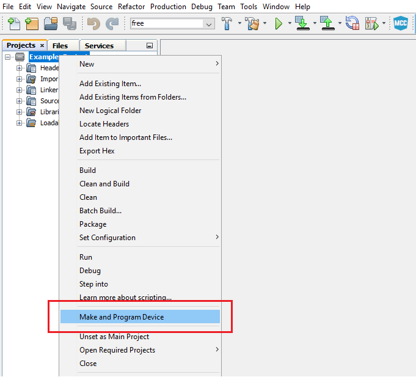
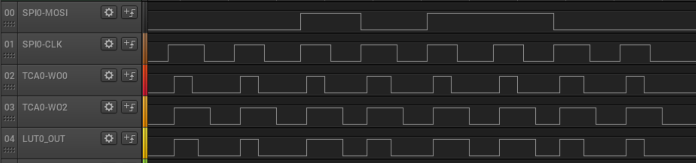

<!-- Please do not change this logo with link -->

# AVR128DA48 RGB lighting with WS2812 using SPI and CCL

This repository provides an MPLAB® X project with an MPLAB® Code Configurator (MCC) generated code example for interfacing the CCL and SPI peripherals with the WS2812 LED.
 The messages compatible with the WS2812 LED are formed from ones and zeros with a specific duration and form. The application translates the messages sent by SPI into messages intelligible by WS2812, using CCL.
 Furthermore, it creates a light game on a WS2812 LED band.
 The peripherals used are:
- Serial Peripheral Interface (SPI)
- Configurable Custom Logic (CCL)
- Timer/Counter Type A (TCA)
- Event System (EVSYS)

## Related Documentation
More details and code examples on the AVR128DA48 can be found at the following links:
- [AVR128DA48 Product Page](https://www.microchip.com/wwwproducts/en/AVR128DA48)
- [AVR128DA48 Code Examples on GitHub](https://github.com/microchip-pic-avr-examples?q=avr128da48)
- [AVR128DA48 Project Examples in START](https://start.atmel.com/#examples/AVR128DA48CuriosityNano)
- [WS2812 Datasheet](https://cdn-shop.adafruit.com/datasheets/WS2812.pdf)

## Software Used
- MPLAB® X IDE 5.40 or newer [(microchip.com/mplab/mplab-x-ide)](http://www.microchip.com/mplab/mplab-x-ide)
- MPLAB® XC8 2.30 or a newer compiler [(microchip.com/mplab/compilers)](http://www.microchip.com/mplab/compilers)
- MPLAB® Code Configurator (MCC) 4.0.1 or newer [(microchip.com/mplab/mplab-code-configurator)](https://www.microchip.com/mplab/mplab-code-configurator)
- MPLAB® Code Configurator (MCC) Device Libraries 8-bit AVR MCUs 2.5.0 or newer [(microchip.com/mplab/mplab-code-configurator)](https://www.microchip.com/mplab/mplab-code-configurator)
- AVR-Dx 1.6.88 or newer Device Pack

## Hardware Used
- AVR128DA48 Curiosity Nano [(DM164151)](https://www.microchip.com/Developmenttools/ProductDetails/DM164151)
- LED Stripe WS2812
- 12V Charger/Voltage Source for the LEDs

## Setup
The AVR128DA48 Curiosity Nano Development Board is used as test platform.
 

The following configurations must be made for this project:

System clock: 24 MHz

SPI0:
- Mode: Host
- Clock frequency: 750 kHz

LUT0:
- IN0: TCA0-WO0
- IN1: SPI-CLK
- IN2: TCA0-WO2
- TRUTH table: 0xE0
- Clock source: CLKPER

TCA0:
- Single-slope PWM mode
- Compare channel 0: enabled
- Compare channel 2: enabled
- Channel 0 waveform duty cycle: 0.4%
- Channel 2 waveform duty cycle: 0.7%
- Period: 100 us

EVSYS:
- Event Generators:
  - SPI0_CLK: CHANNEL0
- Event Users:
  - CHANNEL 0: TCA0CNTB

|Pin               | Configuration      |
| :--------------: | :----------------: |
|PA0 (TCA0-WO0)    | Digital Output     |
|PA2 (TCA0-WO2)    | Digital Output     |
|PA3 (LUT0_OUT)    | Digital Output     |
|PA4 (SPI0-MOSI)   | Digital Output     |
|PA6 (SPI0-CLK)    | Digital Output     |

 **Note:** Only PA3(LUT0_OUT) will be used to transmit data to the WS2812 LED. The rest of the pins are routed outside for visualization of intermediary signals.

## Operation
 1. Connect the board to the PC.

 2. Open the avr128da48-cnano-ws2812-mplab-mcc.X project in MPLAB® X IDE.

 3. Set the avr128da48-cnano-ws2812-mplab-mcc.X project as main project. Right click the project in the **Projects** tab and click **Set as Main Project**.
  

 4. Clean and build the avr128da48-cnano-ws2812-mplab-mcc.X project: right click the **avr128da48-cnano-ws2812-mplab-mcc.X** project and select **Clean and Build**.
  

 5. Select **AVR128DA48 Curiosity Nano** in the Connected Hardware Tool section of the project settings:
   - Right click the project and click **Properties**;
   - Click the arrow right next to Connected Hardware Tool;
   - Select AVR128DA48 Curiosity Nano (click the **SN**), click **Apply** and then click **OK**:

  

 6. Program the project to the board: right click the project and click **Make and Program Device**.
 

Demo:
 The output waveforms are shown in the figure below. SPI_MOSI is the data sent through SPI and the LUT0_OUT is the translated message, intelligible by WS2812 LED.
 

The light game is created on a LED strip which allows control of LEDs in groups of 3. The LED groups are lit from one end to another continuously.
 
 **Note:** The number of LEDs (groups of LEDs) must be configured in firmware. See `NUMBER_OF_LEDS` macro define.

## Summary
The demo shows how to interface WS2812 LED with the SPI peripheral using CCL and TCA.
